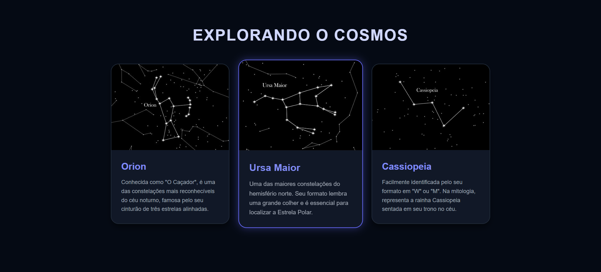

# 🌌 Explorando o Cosmos - Projeto Constelações

> Projeto desenvolvido durante as aulas de Front-end para praticar estruturação de páginas e estilização de layouts em cards.
> 

## 💻 Sobre o Projeto

Este é um projeto de uma página web estática que apresenta informações sobre constelações famosas (Orion, Ursa Maior e Cassiopeia). O objetivo principal foi consolidar conhecimentos em:

* Estrutura semântica do **HTML5**.
* Importação e uso de imagens.
* Criação de layout de cards (containers).
* Estilização externa com **CSS3**.

## 🎨 Layout

O projeto consiste em um título principal seguido de uma grade (grid) contendo cartões informativos. Cada cartão possui:
* Imagem da constelação.
* Título.
* Descrição breve.

## 🛠 Tecnologias Utilizadas

* **HTML5:** Para estruturação do conteúdo.
* **CSS3:** Para estilização e layout (arquivo `style.css`).

## 👩‍💻 Autora

**Isabelle Pantoja**

---
*Projeto desenvolvido para fins de estudo.* 🚀
